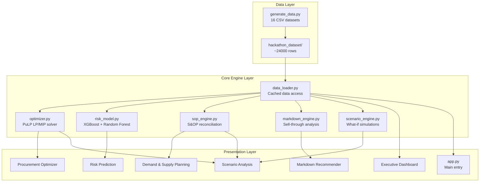
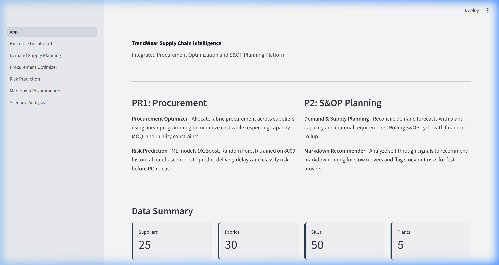
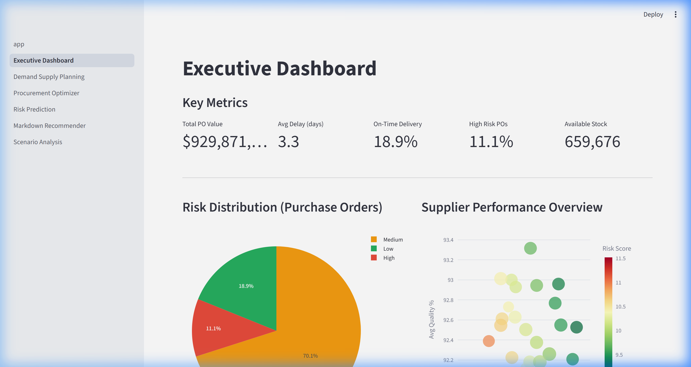
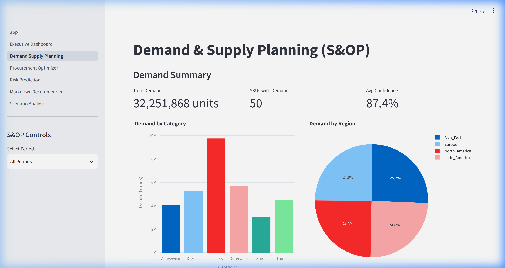
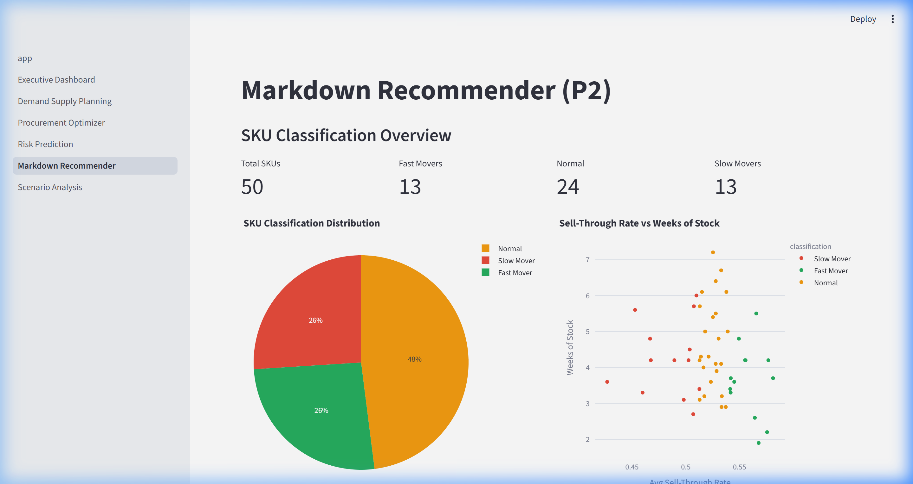
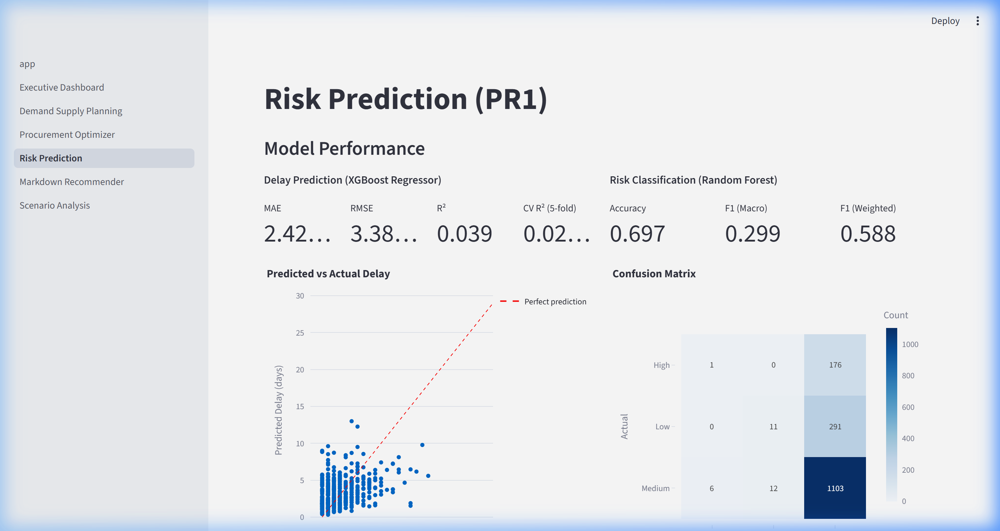
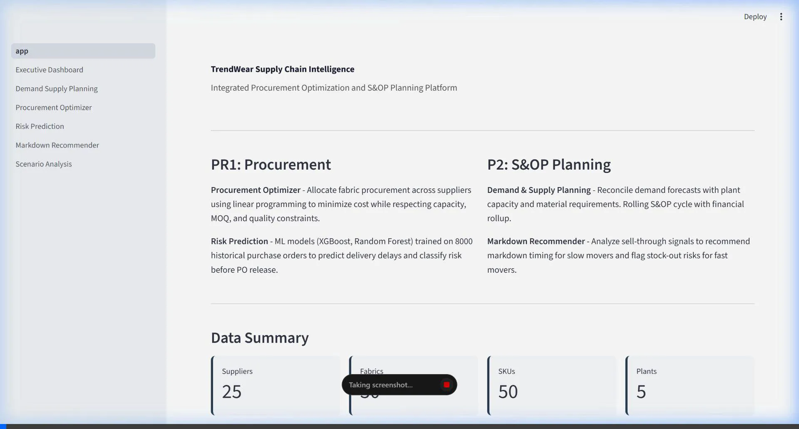

# TrendWear Supply Chain Intelligence Platform

An integrated solution for procurement optimization and S&OP planning built for TrendWear, a fashion apparel company.

## Problem Statement

TrendWear operates with 25 fabric suppliers, 5 manufacturing plants, 5 distribution centres and 100 stores. The company faces two connected challenges:

**PR1 - Procurement**: Allocating fabric procurement across suppliers to minimize cost while balancing risk, capacity and quality constraints. Predicting delivery delays before releasing purchase orders.

**P2 - S&OP Planning**: Synchronizing demand forecasts with plant capacity, fabric lead times and logistics. Reacting to sell-through signals with timely markdowns.

## Solution

This project combines both problems into a single Streamlit application with 6 modules:

| Module | Problem | What It Does |
|--------|---------|------------|
| Executive Dashboard | Both | KPIs, risk distribution, capacity utilization |
| Demand & Supply Planning | P2 | Demand aggregation, MRP, capacity check, financial rollup |
| Procurement Optimizer | PR1 | LP/MIP model (PuLP) for supplier allocation |
| Risk Prediction | PR1 | XGBoost delay regression + Random Forest risk classification |
| Markdown Recommender | P2 | Sell-through analysis, SKU classification, markdown timing |
| Scenario Analysis | Both | What-if: supplier disruption, demand spike, lead time change |

## Tech Stack

- **Python 3.10+** with Streamlit for the UI
- **PuLP** (CBC solver) for linear/mixed-integer programming
- **XGBoost** for delay prediction, **scikit-learn** for risk classification
- **Plotly** for interactive charts
- **pandas/numpy** for data processing

## Setup

```bash
pip install -r requirements.txt
python generate_data.py
streamlit run app.py
```

## Data

The project uses 16 synthetic CSV datasets (~24,000 rows) generated by `generate_data.py`:

**Master Tables**: suppliers (25), fabrics (30), SKUs (50), plants (5)

**Bridge Tables**: BOM (~200), inventory (500), contracts (~250), fabric constraints (~150)

**S&OP Data**: demand forecast (4000), sell-through (2600), markdowns (2000), logistics (2000), plant capacity (~120)

**Procurement/ML Data**: material demand (2000), supplier performance (2000), purchase orders (8000)

## Optimization Model

The procurement optimizer uses a Mixed Integer Program:

**Decision Variables**: x[supplier, fabric] = meters to procure, y[supplier, fabric] = binary MOQ indicator

**Objective**: Minimize (cost_weight * procurement_cost + risk_weight * risk_penalty + lead_time_weight * lead_time_penalty + shortfall_penalty)

**Constraints**:
1. Demand satisfaction (soft, with shortfall penalty)
2. Supplier capacity limits
3. Minimum Order Quantity (binary indicator)
4. Per-contract capacity limits

## ML Models

Trained on 8000 historical purchase orders with 15 features including supplier risk factor, order quantity, lead time, quality scores, and interaction terms.

**Delay Regression** (XGBoost): Predicts delivery delay in days. Features include risk*quantity and risk*lead_time interactions that mirror the underlying delay generation process.

**Risk Classification** (Random Forest): Classifies POs into Low/Medium/High risk categories.

## Project Structure

```
trendwear/
    app.py                     # Main entry point
    generate_data.py           # Data generator (16 CSVs)
    requirements.txt           # Dependencies
    core/
        data_loader.py         # Cached data loading
        optimizer.py           # PuLP procurement optimizer
        risk_model.py          # XGBoost + Random Forest
        sop_engine.py          # S&OP reconciliation
        markdown_engine.py     # Sell-through analysis
        scenario_engine.py     # What-if simulations
    pages/
        1_Executive_Dashboard.py
        2_Demand_Supply_Planning.py
        3_Procurement_Optimizer.py
        4_Risk_Prediction.py
        5_Markdown_Recommender.py
        6_Scenario_Analysis.py
    utils/
        constants.py           # Shared constants
    hackathon_dataset/         # Generated CSVs
```


## Architecture



## Entity Relationship Diagram

```mermaid
erDiagram
    SUPPLIER_MASTER {
        string supplier_id PK
        string supplier_name
        string location
        string tier_rating
        float base_risk_factor
    }

    FABRIC_MASTER {
        string fabric_id PK
        string fabric_name
        string unit_of_measure
        int standard_lead_time_days
        float standard_cost_per_meter
    }

    SKU_MASTER {
        string sku_id PK
        string style_name
        string category
        string season
        float target_unit_price
        date launch_date
    }

    PLANT_MASTER {
        string plant_id PK
        string plant_name
        string city
        int weekly_capacity_units
    }

    BOM_MATERIAL {
        string bom_id PK
        string sku_id FK
        string fabric_id FK
        float fabric_per_unit_meters
    }

    SUPPLIER_CONTRACTS {
        string contract_id PK
        string supplier_id FK
        string fabric_id FK
        float unit_price
        int monthly_capacity_meters
        int contracted_lead_time_days
        int moq_meters
    }

    PURCHASE_ORDERS {
        string po_id PK
        string supplier_id FK
        string fabric_id FK
        int order_quantity_meters
        int delayed_days
        int is_on_time
        string risk_category
    }

    DEMAND_FORECAST {
        string forecast_id PK
        string sku_id FK
        string region
        string period
        int forecasted_demand_units
    }

    INVENTORY {
        string inventory_id PK
        string sku_id FK
        string location_id
        int available_stock_units
        int safety_stock_threshold
    }

    SELL_THROUGH {
        string sell_through_id PK
        string sku_id FK
        string selling_week
        int units_sold
        float sell_through_rate
    }

    SUPPLIER_MASTER ||--o{ SUPPLIER_CONTRACTS : "supplies via"
    FABRIC_MASTER ||--o{ SUPPLIER_CONTRACTS : "sourced through"
    SUPPLIER_MASTER ||--o{ PURCHASE_ORDERS : "receives"
    FABRIC_MASTER ||--o{ PURCHASE_ORDERS : "ordered as"
    SKU_MASTER ||--o{ BOM_MATERIAL : "requires"
    FABRIC_MASTER ||--o{ BOM_MATERIAL : "used in"
    SKU_MASTER ||--o{ DEMAND_FORECAST : "forecasted"
    SKU_MASTER ||--o{ INVENTORY : "stocked"
    SKU_MASTER ||--o{ SELL_THROUGH : "sold"
    PLANT_MASTER ||--o{ PLANT_CAPACITY : "has"
    SUPPLIER_MASTER ||--o{ SUPPLIER_PERF : "evaluated"
```



## Pages Walkthrough

### Main Page


### Executive Dashboard
Shows KPIs: Total PO Value ($929.87M), Avg Delay (3.3 days), OTD Rate (18.9%), risk distribution pie chart, supplier performance scatter, demand by category, and plant utilization.



### Demand & Supply Planning
S&OP reconciliation with demand aggregation (32.25M units), material requirements plan, capacity feasibility check, and financial waterfall.



### Markdown Recommender
SKU classification: 13 Fast Movers, 24 Normal, 13 Slow Movers. Shows markdown recommendations with discount tiers and stock-out alerts.



### Risk Prediction
ML model metrics: XGBoost MAE 2.42 days, R² 0.039; Random Forest Accuracy 69.7%, F1 0.299. Feature importance charts and interactive PO prediction form.



> [!NOTE]
> The low R² (0.039) on the delay regression is expected. The synthetic data uses a negative binomial distribution with high variance, which creates realistic noise that no model can fully explain. In a real-world scenario with actual PO data, R² would be higher. The classification model (Accuracy 69.7%) is more meaningful since it bins the noisy target into 3 categories.

## Full App Recording



## Verification Results

| Check | Result |
|-------|--------|
| Data generation (16 CSVs) | Passed. 24K rows across 16 files. |
| Main page loads | Passed. Title and data summary visible. |
| Executive Dashboard | Passed. 5 KPIs, 4 charts rendered. |
| Demand & Supply Planning | Passed. S&OP cycle runs, all 5 sections display. |
| Procurement Optimizer | Passed. Solver finds Optimal solution. $13.2M cost, 19 suppliers, 97.1% fulfillment. |
| Risk Prediction | Passed. Delay MAE 2.42 days, Risk Accuracy 69.7%. Prediction form works. |
| Markdown Recommender | Passed. 13 Fast / 24 Normal / 13 Slow. Recommendations generated. |
| Scenario Analysis | Passed. Supplier disruption shows cost/risk delta. |